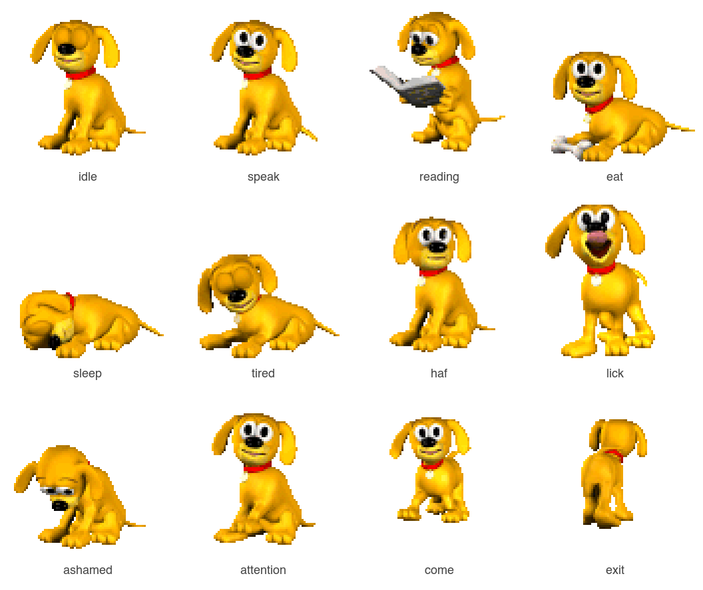

<h1 align="center">Rover.app</h1>

<p align="center">
  <a href="README.md">English</a>
  ·
  <a href="README.ko-KR.md">한국어</a>
</p>

<p align="center">
  <a href="https://github.com/youngjae99/rover-app/releases"></a>
  
  <a href="LICENSE"></a>
  <a href="https://github.com/youngjae99/rover-app/stargazers"></a>
</p>

<p align="center">
  
</p>

<p align="center">
  <strong>Rover is back.</strong> The Windows XP search dog, reborn as a macOS desktop pet that actually drives your coding agent — Claude Code, Codex, or Anthropic Computer Use.
</p>

<p align="center">
  
  <br/>
  <em>twelve of twenty-four states he can play</em>
</p>

> **Demo video.** A 60-second walkthrough is being recorded for the v1 launch. To capture your own meanwhile, use Cmd+Shift+5 → Record Selected Portion, frame Rover plus the bubble, and save the file as `docs/demo.mp4`.

---

## What makes Rover different

Other "AI coding pets" *watch* your agent. Rover *talks back*, and *takes the wheel* when you ask.

- 🐶 **He talks to you.** Click Rover, type a prompt, and an agent answers in an XP-Luna speech bubble that scrolls and stays out of your way.
- 🖱️ **He drives your computer.** Switch the backend to Anthropic Computer Use and Rover takes screenshots, moves the mouse, types, and scrolls for you. With dry-run, action delay, and an Esc kill-switch.
- 🎞️ **He's the real Rover.** Original Windows XP sprite frames and WAV sound effects, kept exactly as they shipped in 2001. Twenty-five years of muscle memory, intact.

This is also a nostalgia project. Not affiliated with Microsoft.

---

## Quick start

### From a DMG (recommended)

1. Download the latest `Rover.dmg` from [Releases](https://github.com/youngjae99/rover-app/releases).
2. Open the DMG, drag `Rover.app` into `Applications`, launch from Launchpad.
3. Click Rover, or click the paw in the menu bar.

> First launch on macOS Gatekeeper: right-click `Rover.app` → Open. Code signing and notarization are tracked in the [Roadmap](#roadmap).

### From source

```bash
git clone https://github.com/youngjae99/rover-app.git
cd rover-app/RoverApp
./run.sh
```

`run.sh` syncs assets from `rover/Resources/`, runs `swift build`, ad-hoc codesigns `Rover.app` (so macOS TCC permissions stay stable across rebuilds), and opens the app. Requires macOS 14+ and Swift 5.9+ (Command Line Tools is enough; full Xcode not required).

### To build a DMG

```bash
cd RoverApp
./package.sh
```

The output is `Rover.dmg` next to the `.app`. The script uses `hdiutil` directly — no `create-dmg` dependency.

---

## Backends

Pick one in **Settings → Backend**.

| Backend | What it does | Setup |
|---|---|---|
| **Claude Code CLI** *(default)* | Wraps `claude -p --output-format stream-json --include-partial-messages`. Animations track tool use in real time. | Auto-detected at common install paths (`/opt/homebrew/bin/claude`, `~/.claude/local/claude`, etc.). |
| **Codex CLI** | Same idea against the OpenAI Codex CLI. | Auto-detected at the standard `codex` install paths. |
| **Anthropic Computer Use** *(beta)* | Talks to the Anthropic API directly via the `claude-opus-4-7` Computer Use loop. **Rover takes screenshots, moves the mouse, types, and scrolls for you.** | Paste your Anthropic API key into Settings → Backend (stored in macOS Keychain). |

> ⚠️ **Computer Use is powerful and can do anything you can do.** Default to **dry-run mode** (Settings → Advanced) until you trust the agent on a given task. Esc cancels the loop at any time, mid-tool.

---

## Triggers

Rover doesn't have to wait for a click. Each trigger is independently toggleable in **Settings → Triggers**.

- **Global hotkey** (⌘⇧Space). Summon the bubble from anywhere, even when another app is full-screen.
- **Active app change**. When you switch apps, Rover plays a short animation and (optionally) shows a hint. No agent calls — zero cost.
- **Periodic screen observation**. On a configurable interval, Rover sends a screenshot to Computer Use to check whether you need help. Each glance costs API credits, so the default is 10 minutes.
- **Scheduled tasks**. Per-day HH:MM entries with a fixed prompt, run through the active backend.

---

## Pet behavior

- Floating, borderless, transparent window. Drag him anywhere on screen.
- 24 animation states from the original sprite sheet (idle, idle fidgets, sleep, speak, eat, reading, ashamed, lick, haf, exit).
- Original WAV sound effects (Haf, Lick, Whine, Snoring, Tap).
- Sleep after 60 seconds of inactivity. Click to wake.
- XP Luna speech bubble. Grows upward from a fixed bottom anchor, scrolls when content overflows, never crosses the top of the screen.
- Session-aware: recent prompts and reasoning persist into the next conversation.

---

## Keyboard and mouse

| Action | Effect |
|---|---|
| Click Rover | Open the input bubble |
| Drag Rover | Move the floating window |
| Right-click Rover | Context menu (Ask, Sound, Model, Settings, Quit) |
| Click menu-bar paw | Open the bubble from anywhere |
| ⌘⇧Space | Global hotkey (enable in Settings → Triggers) |
| ⌘, | Settings window |
| Esc | Dismiss the bubble, cancel the running agent |
| ⌘Q | Quit |

---

## Permissions on first run

Computer Use, the global hotkey, and the active-app trigger each need different macOS permissions. Rover prompts you the first time each is needed.

| Permission | Needed for |
|---|---|
| **Accessibility** | Mouse and keyboard control, global hotkey |
| **Screen Recording** | Periodic screen observation, Computer Use screenshots |
| **Apple Events** | Active-app trigger (reads which app is in the foreground) |

API keys live in macOS Keychain, never in plain config files.

---

## Settings (six tabs)

- **General** — language (System / English / 한국어), menu-bar toggle, sound toggle, working directory.
- **Backend** — pick the active backend, paste your Anthropic API key.
- **Triggers** — enable and tune each of the four triggers above.
- **Model** — pick Claude Opus 4.7, Sonnet 4.6, or Haiku 4.5 for CLI backends.
- **System Prompt** — persistent append-system-prompt with reset to default per language.
- **Advanced** — dry-run toggle, action delay, `--dangerously-skip-permissions` for CLI backends, version and binary paths.

---

## How it works

```
trigger        click             ⌘⇧Space hotkey
hotkey         active-app        scheduled task
periodic       change            etc.
        \      |       /
         v     v      v
       TriggerContext
              |
              v
       AppViewModel
              |
              v
       AgentCoordinator
              |
   +----------+-----------+--------------------+
   v                      v                    v
ClaudeCodeCLI         CodexCLI         AnthropicComputerUse
(stdin -> stream-json) (stdin -> JSON)  (HTTPS, computer-use loop)
        \                |               /
         v               v              v
              AgentEvent stream
                    |
        +-----------+-----------+
        v                       v
   SpeechBubbleView         AnimationMapper
   (text accumulates,       (event -> RoverState)
    autoscroll)                  |
                                 v
                          SpriteAnimator
                          (NSImage sequence,
                           8 to 14 fps)
                                 |
                                 v
                          RoverSpriteView
```

For Computer Use, the loop additionally goes:

```
AnthropicAPIClient         (HTTPS, beta header)
        |
        v
ComputerUseAction (screenshot / click / type / key / scroll / ...)
        |
        v
SafetyController (dry-run? action delay?)
        |
        v
ComputerUseDispatcher
        |
   +----+----+----+
   v    v    v    v
Screenshot Mouse Keyboard ActiveWindow
```

For repository layout, see [CONTRIBUTING.md](CONTRIBUTING.md).

---

## Roadmap

Tracked publicly so contributors can pick something up. PRs welcome on any of these.

- [ ] **Code signing + notarization** for distribution. Local builds are ad-hoc signed (enough to keep TCC stable), but Gatekeeper still requires a right-click Open on first launch from a DMG.
- [ ] **Auto-update** via Sparkle.
- [x] **Permission bubble** — Claude Code `PreToolUse` hook is auto-installed (opt-in via Settings → Backend) and tool permission asks land as Allow / Deny in the speech bubble. Falls back to Claude's terminal prompt when Rover isn't running.
- [ ] **Markdown rendering** for responses. Plain text only at the moment.
- [ ] **A UI to set the path to the `claude` CLI** for installations that don't match auto-detected paths.
- [ ] **Observer mode for other agents** — Cursor Agent, Gemini CLI, Copilot CLI, opencode hooks.
- [ ] **Sessions HUD** — per-session chips next to Rover for parallel agents.
- [ ] **Custom themes** — drop a sprite pack in `~/Library/Application Support/Rover/Themes/`.
- [ ] **Do Not Disturb** mode.
- [ ] **Multi-monitor awareness**.

---

## Localization

- English and 한국어 today.
- System language is auto-detected. Manual override in Settings.
- Adding a language? Drop a strings file in `Sources/RoverApp/Localization.swift` and open a PR.

---

## Credits

- Rover character, sprite frames, and sound effects: copyright Microsoft Corporation, originally shipped with Windows XP Search Companion (2001).
- Claude Code: [Anthropic](https://anthropic.com).
- macOS revival: this repository.

The `rover/` directory contains the original assets together with a small C# Windows Forms reimplementation that this project used as a reference. Everything in `rover/` is included for archival and educational purposes only.

---

## License

- Original Microsoft Rover assets are property of Microsoft Corporation. They are included under fair use for nostalgia and educational purposes only. Do not redistribute commercially.
- The Swift code added by this repository is released under the MIT License.

> Rover left with Vista. We never quite said goodbye.
